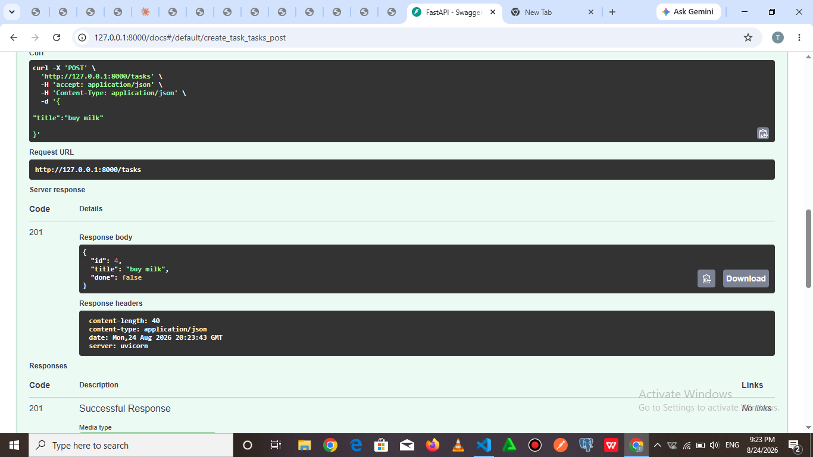
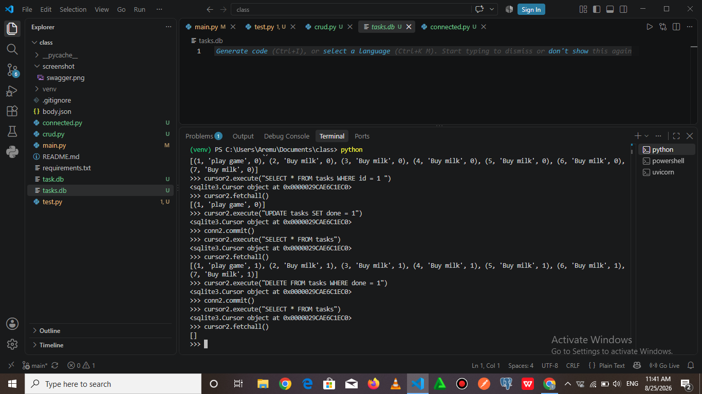

Dependencies to install
pip install -r requiremnt.txt

To start server
```bash
uvicorn main:app --reload
```

URL to run
run http://127.0.0.1:8000/docs in your browser

| Method | Path | Description |
|--------|------|-------------|
| GET | / | Root endpoint, basic welcome/status message |
| GET | /health | Check if the server is running |
| GET | /tasks | Fetch the full list of tasks |
| GET | /tasks/{id} | Fetch a single task by its ID |
| POST | /tasks | Create a new task and add it to the list |
| PUT | /tasks/{id} | Update an existing task by its ID |
| DELETE | /tasks/{id} | Permanently delete a task by its ID |

curl.exe -g -i -X POST "http://127.0.0.1:8000/tasks" -H "Content-Type: application/json" -d "@body.json"




## Database (SQLite)

**Why SQLite:** SQLite was chosen because it needs no separate database server to install or run, the entire database is a single file, and Python's built-in `sqlite3` module supports it with zero extra dependencies. This makes it ideal for a small learning project like this one.

**Where the database file lives:** the database is stored in `task.db`, in the project's root folder. It is created automatically the first time the app runs.

**How to run the project:**
```bash
pip install -r requirements.txt
uvicorn main:app --reload
```
Then open `http://127.0.0.1:8000/docs` in your browser.

**Example SQL query used:**
```sql
SELECT * FROM tasks WHERE done = 1;
```
This returns every task currently marked as completed.

